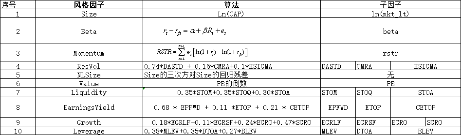

# Barra(CNE5)因子说明文档

## 因子说明

### 因子解释说明

| 因子                      | 含义                             |
| ------------------------- | -------------------------------- |
| 市值因子（Size）          | 上市公司大盘股的程度             |
| 非线性市值因子（NLSize）  | 上市公司规模处于中等的程度       |
| 价值因子（Value）         | 记账价值和市值的比值             |
| 成长因子（Growth）        | 净资产、盈利和盈利预期综合度量   |
| 动量因子（Momentum）      | 3个月短期动量                    |
| 盈利因子（EarningsYield） | 盈利和股票市值的比值             |
| 杠杆因子（Leverage）      | 上市公司的杠杆使用情况           |
| 流动性因子（Liquidity）   | 由交易量和频率不同而带来的收益   |
| Beta因子（Beta）          | 上市公司与股票指数之间的协同效应 |
| 残差波动率因子（Resvol）  | 对大盘偏离旳不确定性             |

### 因子算法简略说明

## 因子介绍

### 1. Size

* Definition：

  > $Ln(cap)$
  >
  > Natural log of market cap,
  >
  > Given by the logarithm of the total market capitalization of the firm

### 2. Beta

* Definition:

  > $\beta$
  >
  > Computed as the slope coefficient in a rime-series regression of excess stock return,
  >
  > $r_t - r_{ft}$,against the cap-weighted excess return of the estimation universe $R_t$,
  > $$
  > r_t -r_{ft} = \alpha + \beta R_t +e_t           \tag{A1}
  > $$
  > The regression coefficients are estimated over the trailing 252 trading days of returns with a half-life of 63 trading days

  

  

### 3. Momentum

* Definition:

  > $RSTR$        Relative Strength
  >
  > Computed as the sum of excess log returns over the trailing T = 504 trading days th a lag of I =21 trading days,
  > $$
  > RSTR = \sum^{T+L}_{t=L}{w_t[ln(1+r_t)-ln(1+r_{ft})]} \tag{A2}
  > $$
  > where $r_t$ is the stock return on day $t$, $r_{ft}$ is the risk-free return, and $w_t$ is an exponential weight with a half-lift of 126 trading days.

### 4. Residual Volatility

* Definition:

  > $$
  > 0.74 * DASTD + 0.16*CMRA + 0.1 * HSIGMA
  > $$
  >
  > $DASTD$ Daily standard deviation
  >
  > Computed as the volatility of daily excess returns over the pass 252 trading days with a half-life of 42 trading days.

  >$CMRA$   Cumulative range
  >
  >This descriptor differentiates stocks that have experienced wide swings over the last 12 months from those that have traded within a narrow range, Let $Z(T)$ be the cumulative excess log return over the past $T$ months, with each month defined as the previous 21 trading days
  >$$
  >Z(T) = \sum^T_{t=1}[ln(1+r_t) - ln(1+r_{ft})] \tag{A3}
  >$$
  >where $r_t$ is the  the stock return for month $t$ (compounded over 21 days), and $r_{ft}$ is the risk-free return. The cumulative range s give by 
  >$$
  >CMRA  = ln(1+Z_{max}) - ln(1+Z_{min})  \tag{A4}
  >$$
  >where $Z_{max} =  max\{Z(T)\}$, $Z_{min} = min\{Z(T)\}$ , and T =1,2,..12.

  >$HSIGMA$   Historical sigma($\sigma$)
  >
  >Computed as the volatility of residual returns in Equation $A1$,
  >$$
  >\sigma = std(e_t)  \tag{A5}
  >$$
  >The volatility is estimated over the trailing 252 trading days of returns with a half-life of 63 trading days.
  >
  >The Residual volatility factor is orthogonalized with respect to Beta and Size to reduce collinearity.

  ### 5. Non-linear Size

* Definition:

  > $NLSIZE$ cube of size
  >
  > First, the standardized Size exposure (i.e., log of market cap) is cubed. The resulting factor is then orthogonalized with respect to the Size factor on a regression-weighted basis. Finally, the factor is winsorized and standardized.

### 6. Book-to-Price(Value)

* Definition:

  > $BTOP$ Book-to-price ratio
  >
  > Last reported book value of common equity divided by current market capitalization.

### 7. Liquidity

* Definition:

  > $$
  > 0.35 * STOM + 0.35 * STOQ + 0.3 * STOA
  > $$
  >
  > $STOM$ Share turnover, one month
  >
  > Computed as the log of the sum of daily turnover during the previous 21 trading days,
  > $$
  > STOM = ln( \sum^{21}_{t=1}\frac{V_t}{S_t}  ) \tag{A6}
  > $$

  > $STOQ$ Average share turnover, trailing 3 months
  >
  > Let $STOM_t$ be the share turnover for month $t$, with each month consisting of 21 trading days. The quarterly share turnover is defined by 
  > $$
  > STOQ  = ln[\frac{1}{T}\sum^T_{t=1}exp(STOM_t)], \tag{A7}
  > $$
  >  where $T=3 $ months.

  > $STOA$ Average share turnover, trailing 12 months
  >
  > Let $STOM_t$ be the share turnover for month $t$, with each month consisting of 21 trading days. The annual share turnover is defined by  
  > $$
  > STOA = ln[\frac{1}{T}\sum^T_{t=1}exp(STOM_t)],  \tag{A8}
  > $$
  > where T =21 months.
  >
  > The Liquidity factor is orthogonalized with respect to Size to reduce collinearity.

### 8. Earnings Yeld

* Definition:

  > $$
  > 0.68 * EPFWD + 0.21* CETOP + 0.11 *ETOP
  > $$
  >
  > $EPFWD$ Predicted earnings-to-price ratio
  >
  > Given by the 12-month forward-looking earnings divided by the current market capitalization. Forward-looking earnings are defined as a weighted average between the average analyst-predicted earnings for the current and next fiscal years.

  > $CETOP$  Cash earnings-to-price ratio
  >
  > Given by the trailing 12-month cash earnings divided by current price.

  > $ETOP$ Trailing earnings-to_price ratio
  >
  > Given by the trailing 12-month earnings diveided by the current market capitalization.
  >
  > Trailing earnings are defined as the last reported fiscal-year earnings plus the difference between current interim figure and the comparative interim figure from the previous year.

### 9. Growth

* Definition：

  > $$
  > 0.18 *EGRLF + 0.11 *EGRSF + 0.24*EGRO +0.47*SGRO
  > $$
  >
  > $EGRLF$ Long-term predicted earnings growth
  >
  > Long-term(3-5 years) earnings growth forecast by analysts.

  > $EGRSF$ Short-term predicted earnings growth
  >
  > Short-term(1 year) earnings growth forecasted by analysts.

  >$EGRO$  Earnings growth(trailing five years)
  >
  >Annual reported earnings per share are regressed against time over the past five fiscal years. The slope coefficient is then divided by the average annual earnings per share to obtain the earnings growth.

  > $SGRO$ Sales growth(trailing five years)
  >
  > Annual reported sales per share are regressed against time over the past five fiscal years. The slope coefficient is then divided by the average annual sales per share to obtain the sales growth.

### 10. Leverage

 * Definition:

   > $$
   > 0.38 * MLEV + 0,35 * DTOA + 0.27 * BLEV
   > $$
   >
   > $MLEV$ Market leverage
   >
   > Computed as 
   > $$
   > MLEV = \frac{ME + PE +LD}{ME} \tag{A9}
   > $$
   > where $ME$ is the a market value of common equity on the last trading day, $PE$ is the most recent book value of preferred equity, and $LD$ is the most recent book value of long-term debt

   > $DTOA$ Debt-to-asset
   >
   > Computed as 
   > $$
   > DTOA = \frac{TD}{TA}
   > $$
   > where $TD$ is the book value of total debt(long-term debt and current liabilities), and $TA$ is most recent book value of total assets.

   > $BLEV$ Book leverage
   >
   > Computed as 
   > $$
   > BLEV = \frac{BE +PE+LD}{BE}
   > $$
   >  where $BE$ is the most recent book value of common equity, $PE$ is the most recent book value of preferred equity, and $LD$ is the most recent book value of long-term debt

[^1]: https://zhuanlan.zhihu.com/p/31684647

--------------

## **依赖数据**

| 序号 | 表名                         | 表名_中文                 | 数据源     |
| ---- | ---------------------------- | ------------------------- | ---------- |
| 1    | AShareEODPrices              | 中国A股日行情             | Wind数据库 |
| 2    | AShareST                     | 中国A股特别处理           | Wind数据库 |
| 3    | ASharelndustriesClassCITICS  | 中国A股中信行业分类       | Wind数据库 |
| 4    | ASharelndustriesCode         | 行业代码                  | Wind数据库 |
| 5    | Aindexmembers                | 中国A股指数成份股         | Wind数据库 |
| 6    | AIndexHS300FreeWeight        | 沪深300免费指数权重       | Wind数据库 |
| 7    | AlndexIndustriesEODCITICS    | 中国A股中信行业指数日行情 | Wind数据库 |
| 8    | AlndexEODPrices              | 中国A股指数日行情         | Wind数据库 |
| 9    | AShareDescription            | 中国A股基本资料           | Wind数据库 |
| 10   | AShareEODDerivativelndicator | 中国A股日行情估值指标     | Wind数据库 |
| 11   | CBondBenchmark               | 法定存贷款利率            | Wind数据库 |
| 12   | AShareConsensusRollingData   | Wind一致预测个股滚动指标  | Wind数据库 |
| 13   | AShareIncome                 | 中国A股利润表             | Wind数据库 |
| 14   | AShareCapitalization         | 中国A股股本               | Wind数据库 |
| 15   | AShareBalanceSheet           | 中国A股资产负债表         | Wind数据库 |
| 16   | AShareFinancialIndicator     | 中国A股财务指标           | Wind数据库 |
| 17   | AlndexCSIAllINDWeight        | 中证全指指数权重          | Wind数据库 |
| 18   | AIndexWindlndustriesEOD      | 中国A股Wind行业指数日行情 | Wind数据库 |

## 数据清单
1.  流通市值